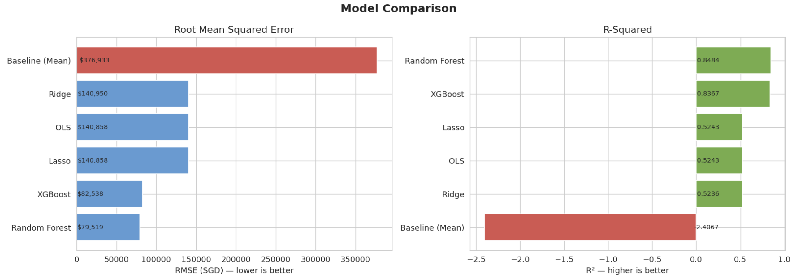

Chan Mu Jie, Chelsea Gan, Gan Xin Yee, Zahra Prilia Kinanti

## 1. Context
In Singapore, proximity to “good” primary schools is widely believed to influence housing choices due to the distance-based priority system in Primary 1 (P1) admissions, where living closer increases the likelihood of securing admission particularly in Phases 2B and 2C. This leads to strong market perceptions that housing near such schools command price premiums. 

For the Ministry of National Development (MND), which is responsible for monitoring market conditions and ensuring public housing affordability, understanding the drivers of HDB resale prices is critical. HDB resale flats constitute a major segment of Singapore’s housing market, yet the impact of school proximity remains largely unquantified and is often only accessed qualitatively. 

By combining school demand data, housing transactions, and spatial features, this project provides a data-driven understanding of how school-related factors influence housing market outcomes.

## 2. Scope
### 2.1. Problem
MND currently lacks a publicly available official validated estimate of the effect of proximity to “good” primary schools on HDB resale prices. With the HDB resale market recording many transactions annually and prices rising in recent years, even a modest school-related price premium can translate into substantial market-wide price differences. 

Without a systemic estimate, MND faces challenges in monitoring price drivers, specifically whether price increases are driven by flat characteristics or behavioural factors like perceived school quality. Additional challenges include assessing affordability impacts and evaluating whether P1 distance-based admission has spillover effects on the housing market. This gap also contributes to broader information asymmetry in the market, where buyers and sellers rely on heuristics rather than evidence when pricing or purchasing flats near popular schools.

Data science is an appropriate solution as it allows for the integration of school demand, location, and housing transaction data to isolate the effect of school proximity while controlling for other housing attributes. Machine learning models can capture non-linear relationships, like distance-based effects, and interactions across variables.

### 2.2. Success Criteria
The success of this project is evaluated on business and operational outcomes.

From a business perspective, the main goal is to produce a reliable and interpretable estimate of how proximity to “good” primary schools affects HDB resale prices. This includes quantifying the magnitude of the effect and assessing its consistency across flat types and locations. 

A secondary business goal is to enhance market transparency and policy insight by providing a data-driven framework for evaluating school-related housing value. This supports MND’s role in monitoring housing affordability and identifying potential unintended effects of existing policies.

From an operational perspective, the model should achieve strong performance in estimating resale prices, with clear interpretability of key features such as school proximity and amenity access. Additionally, the data pipeline should be reproducible and scalable, allowing the model to be updated as new transaction or school data become available.

### 2.3. Assumptions
It is assumed that proximity to primary schools is a significant factor influencing HDB resale prices, and that the constructed definition of “good” schools reasonably captures perceived school quality.

Chosen datasets are also assumed to be sufficiently representative of the market. Geographic distance serves as a reasonable approximation of accessibility, despite not fully capturing factors such as walking routes, transport connectivity, or physical barriers.

Finally, it is assumed that relationships observed in historical data are stable and generalisable to current housing decisions.

## 3. Methodology
### 3.1. Technical Assumptions
A key technical assumption in this study is the definition of “good” primary schools. Direct measures of school quality are not publicly available, so proxy indicators are employed.

Two main types are used. First, demand-based proxies are derived from oversubscription rates in the P1 registration exercise, on the assumption that schools with higher applicant-to-vacancy ratio are more desirable. This is operationalised through features such as average demand percentile, demand stability, and supply-adjusted demand, which are combined into a composite score. Second, institutional proxies, namely schools with Special Assistance Plan (SAP) scheme and Gifted Education Programme (GEP), are assumed to indicate established academic reputation and quality. Finally, a school is classified as “good” if its composite score ≥ threshold of one standard deviation above the mean (to identify schools that are above average in demand), and satisfies at least one institutional criterion (SAP/GEP). 

School desirability is constructed using data from 2009 onwards and applied across the resale dataset, implicitly assuming that school reputation is relatively stable over time. This is reasonable given the persistence of institutional characteristics and is reinforced by the use of multi-year averages, but may introduce measure error for earlier transactions.

HDB block polygons are used as proxies for flat-level spatial position, assuming minimal variation in location within a block. It is assumed that all HDB blocks have access to a bus stop within a short walking distance. Thus, bus accessibility is excluded as a variable due to limited variation. Amenity locations are represented as point coordinates rather than full polygons, as relative distance is the primary concern. MRT opening year data is sourced from an unofficial dataset but its reliability is sufficient for preprocessing use.

Finally, the key hypothesis is that proximity to “good” primary schools has a positive effect on HDB resale prices, with stronger effects expected for closer distance bands.

### 3.2. Data
This study combines the following datasets to construct variables linking primary school quality to HDB resale prices: (i) primary school demand data, (ii) school location data, (iii) HDB transaction and property data, and (iv) transport and amenity data.

#### 3.2.1. Collection
Primary school demand data was scraped from [sgschooling.com](https://sgschooling.com/), covering 2009–2025 with fields such as school name, year, phase, vacancies, and applicants. School locations were sourced from the [Ministry of Education directory on data.gov.sg](https://data.gov.sg/datasets/d_688b934f82c1059ed0a6993d2a829089/view) and geocoded using the OneMap API in GeoPandas.

[HDB resale transactions](https://data.gov.sg/collections/189/view), [property information](https://data.gov.sg/datasets/d_17f5382f26140b1fdae0ba2ef6239d2f/view), and [existing building](https://data.gov.sg/datasets/d_16b157c52ed637edd6ba1232e026258d/view) datasets were obtained from data.gov.sg for transaction details, validating active blocks and deriving spatial geometries. Additional data include [LTA MRT exit locations](https://data.gov.sg/datasets/d_b39d3a0871985372d7e1637193335da5/view), [NEA hawker centre locations](https://data.gov.sg/datasets/d_4a086da0a5553be1d89383cd90d07ecd/view), [MRT opening years](https://www.kaggle.com/datasets/lzytim/full-list-of-mrt-and-lrt-stations-in-singapore?select=mrt_lrt_stations_2025-01-14.csv) from Kaggle, [SLA land parcels](https://data.gov.sg/datasets/d_e7395d743076a2bcc487b0d12b9bf33b/view) and [LTA road code](https://www.lta.gov.sg/content/ltagov/en/industry_innovations/industry_matters/development_construction_specifications_resources/street_works/requirements_for_street_work_proposals/gis_data_hub_collection.html) datasets for spatial matching and standardisation.

#### 3.2.2. Cleaning
For school demand data, only Phase 2B and Phase 2C observations were retained, as these represent competitive allocation stages. Numerical fields were standardised, and rows with missing or invalid values were removed. Observations with zero vacancies were excluded to avoid undefined oversubscription ratios. School names were standardised using string cleaning techniques. Only key variables like name, coordinates and good school defining variables were retained in the final good school dataset.

For HDB data, multiple year-split datasets were standardised then merged into one main dataframe. Duplicate transactions were removed, and resale records were filtered to retain only active block information. All spatial datasets were transformed from EPSG:4326 to EPSG:3414, ensuring consistent distance calculations in metres.

#### 3.2.3. Features

Feature engineering focuses on constructing variables that capture school desirability, spatial accessibility and housing characteristics.

At the school level, oversubscription was defined as the ratio of applicants to vacancies, aggregated across Phases 2B and 2C. To account for the 2022 policy change, oversubscription values were converted into within-year percentile ranks, and averaged across years to obtain `avg_demand_percentile`. Additional features include `stability_raw`, measured as the standard deviation of yearly demand percentiles, and `supply_adjusted_demand_raw`, derived by controlling for the number of nearby schools within a 1 km radius to isolate demand beyond local supply constraints. These components were standardised and combined with equal weights to form a `composite_score`, representing overall school demand. Variables `is_SAP` and `has_GEP` were manually annotated as binary indicators of institutional quality.

At the HDB transaction level, the shortest distance between geometric representations captured proximity to schools and amenities. School accessibility was measured using the number of good primary schools within defined distance bands (<1km, 1–2km, >2km), which aligned with the priority rules in the P1 registration system. HDB locations were represented using polygons derived from land parcel data, while primary school locations were geocoded and represented as spatial geometries. All spatial features were computed using projected coordinates in EPSG:3414 and distance was expressed in metres.

To capture neighbourhood convenience and connectivity, distances to the nearest MRT station and hawker centre were computed using projected coordinates. Additional features include flat characteristics, block-level amenities, transaction timing and categorical variables such as town, flat type and flat model. Lease attributes were derived under the assumption all HDBs have 99-year leases.

The table below summarises the final key features.

| Group                   | Features                                                                    | Description                                              |
|-------------------------|-----------------------------------------------------------------------------|----------------------------------------------------------|
| Target Variable         | `resale_price`                                                              | Transaction price of the flat                            |
| Flat Characteristics    |`floor_area_sqm`, `lease_commence_date`, `remaining_lease_2026`, `storey_mid`| Physical and lease attributes of the flat                |
| Transaction Timing      | `sold_year`                                                                 | Year of transaction                                      |
| Block Amenities         | `market_hawker`, `miscellaneous`, `multistorey_carpark`, `precinct_pavilion`| Indicators for amenities attached to the block           |
| Accessibility           | `mrt_dist`, `hawker_dist`                                                   | Distance to nearest MRT station and hawker centre        |
| School Proximity        | `good_sch_lt_1km`, `good_sch_1_2km`, `good_sch_gt_2km`                      | Counts of “good” schools within distance bands           |
| Location                | `town_*`                                                                    | Indicator for town-level location                        |
| Flat Type               | `flat_type_*`                                                               | Indicator for flat type                                  |
| Flat Model              | `flat_model_*`                                                              | Indicator for flat design models                         |

<i>Table 1: Summary of key features</i>

#### 3.2.4. Splitting
A temporal train-test split was adopted to better reflect a real-world forecasting and policy-monitoring setting, where future resale transactions are estimated using past observations only. Transactions from 2023 and earlier were used for model training, while transactions 2024 to 2025 were reserved for out-of-sample testing. This prevents data leakage and provides realistic assessment of model generalisation.

The target variable is `resale_price`, with all remaining variables used as predictors. 

### 3.3. Experimental Design
Several models were implemented to balance interpretability and predictive performance. Ordinary Least Squares (OLS) was the primary model because it is a commonly used hedonic pricing framework, providing interpretability on the relationship between resale price and school proximity. This allows public policy officers to predict prices accurately and explain how school-related factors contribute to housing affordability outcomes.

Ridge and Lasso regression were included to address multicollinearity and improve coefficient stability. Lasso additionally performs feature selection, which is useful in a setting with a relatively large number of engineered and one-hot encoded predictors. To capture effects that may not be well represented in linear models, Random Forest and XGBoost were also evaluated. A baseline model predicting the mean training-set resale price was used as a benchmark to assess the predictive gains of more complex models.

Model performance was evaluated using Root Mean Squared Error (RMSE) and R². RMSE measures prediction error in Singapore dollars, making it directly interpretable for the housing market context while penalising large prediction errors more heavily. R² was used as a complementary measure of explanatory power. These metrics assess both practical predictive accuracy and overall model fit.

For OLS, multicollinearity was assessed using Variance Inflation Factors (VIF), removing highly collinear variables to improve coefficient interpretability and stability. `good_sch_gt_2km` (VIF = 53,489) and `lease_commence_date` were excluded due to near-perfect collinearity; `good_sch_lt_1km` was retained but statistically insignificant. Ridge and Lasso hyperparameters were selected through cross-validation conducted on the training set only. Random Forest and XGBoost were tuned more lightly to balance predictive performance with computational efficiency. Comparing results across all models also provides a robustness check on whether the estimated importance of school proximity is consistent across different modelling assumptions.

## 4. Findings
### 4.1. Results
Figure 1 summarises the performance of all models evaluated, using RMSE and R² on the test set.

<i>Figure 1: Model evaluation comparison</i>

All models outperform the baseline, whose high RMSE (\$376,933) and negative R² (-2.41) reflect strong long-term price appreciation, making the historical mean a poor predictor.

Among linear models, OLS, Ridge, and Lasso achieve nearly identical performance (RMSE ~\$140,858, R² ~0.524). The minimal regularisation selected and the fact that Lasso retains all features indicate that the OLS model is well-specified and not overfitting.

As this project focuses on estimating the effect of school proximity, the OLS hedonic pricing model is used as the primary model due to its interpretability. Table 2 shows the estimated effect, controlling for flat size, storey level, remaining lease, town, MRT distance, hawker distance, and flat type.

| Distance Band | Coefficient | p-value    | 95% CI           | Interpretation                  |
|---------------|-------------|------------|------------------|---------------------------------|
| <1km          | -$125       | 0.596      | [-$588, $338]    | Not statistically significant   |
| 1–2km         | +$1,324     | <0.001 *** | [$1,012, $1,637] | Highly significant              |

<i>
Table 2: Effect of school proximity. 
<code>good_sch_gt_2km</code> was excluded due to high VIF (53,489). 
<code>good_sch_lt_1km</code> was retained but is not statistically significant.
</i>

Each additional good primary school within 1–2km is associated with a statistically significant price premium of \$1,324, holding all other factors constant. These results are consistent across all linear models (within 3% variation), indicating that the findings are not sensitive to model specification or multicollinearity.

Predictive models such as Random Forest achieve higher accuracy (RMSE \$79,519, R² 0.848), but are not used for effect estimation due to their lack of interpretability. Instead, they serve as robustness checks. Notably, both school proximity variables rank among the top 15 most important features (out of 64) in the Random Forest model, providing independent confirmation that school proximity is a key driver of resale prices even in non-linear settings.

### 4.2. Discussion
#### 4.2.1. Business Implications
The key finding is that the price premiums concentrate in the 1–2km distance band, rather than the sub-1km band. As mentioned in section 4.1, each additional good primary school within 1–2km adds \$1,324, holding all other characteristics constant. This implies that a flat near three good schools in this band is estimated to command ~\$3,972 more than an otherwise identical flat. On the other hand, the effect within 1km is not statistically significant.

The non-significance of the <1km band challenges the common assumption that being closest to a good school yields the highest housing premium. One explanation is that much of the price premium is already captured by town-level factors, since good schools tend to be located in mature or higher-value areas, and these broader location advantages are absorbed by the town fixed effects in the model. At the same time, flats located immediately adjacent to schools may face practical disamenities, such as traffic congestion and noise during peak hours, which can offset any additional benefit from proximity. The 1–2km band represents the sweet spot, being close enough to qualify for Phase 2B/2C distance priority while avoiding these disamenities.

For MND, this suggests that housing price effects are driven more by neighbourhood-level access to good schools rather than direct adjacency. From a planning perspective, this implies that expanding access to good schools across neighbourhoods, rather than concentrating them within already premium areas, may be more effective in managing housing price disparities.

#### 4.2.2. Model Interpretability
A key tension in this project is between interpretability and predictive accuracy. While OLS achieves moderate performance (R² = 0.524), it provides fully interpretable coefficients with clear dollar effects and statistical significance. In contrast, Random Forest achieves higher accuracy (R² = 0.848) but does not yield interpretable estimates of school proximity effects.

As the objective is policy-focused effect estimation rather than prediction, OLS is used as the primary model, with Random Forest retained only as a complementary robustness check.The OLS model can provide transparent, defensible estimates of how school access impacts housing prices, which is critical for policy evaluation and planning decisions.

#### 4.2.3. Concerns About Bias
Several sources of bias should be acknowledged:

(i) Omitted variable bias may persist, as unobserved factors such as household income or neighbourhood prestige may influence both school proximity and resale prices; town fixed effects mitigate but do not eliminate this. 

(ii) The definition of “good school,” based on oversubscription and SAP/GEP status, may not fully reflect buyer perceptions, potentially affecting the estimated premium.

(iii) The gap between training R² (0.842) and test R² (0.524) suggests the model does not fully generalise to 2024–2025 transactions. Retraining on more recent data is advised before operational deployment.

(iv) The Durbin-Watson statistic (0.294) indicates positive autocorrelation, meaning standard errors in Table 2 are likely underestimated and confidence intervals should be interpreted with caution. Applying HAC/Newey-West standard errors in future iterations would produce more reliable inference.

Overall, the estimated school premium should be interpreted as indicative rather than strictly causal, and used alongside domain knowledge for policy decisions. There are also fairness concerns: applying such insights may reinforce existing price disparities, creating a feedback loop between school reputation and housing demand.

### 4.3. Recommendation 
#### 4.3.1. Deployment
We recommend using Random Forest as a price estimation tool for MND policy officers, while retaining OLS as the primary model for policy analysis and effect estimation. These models serve complementary roles and should be maintained in parallel.

Random Forest can be deployed as a pricing benchmark to assess whether flats are fairly valued. OLS should support policy analysis, such as estimating the financial impact of opening a new good primary school in a given area, or evaluating pricing effects of changes to registration rules.

Additionally, both models should be retrained periodically as new transaction and school data become available, particularly as school supply and policies evolve.

#### 4.3.2. Data Quality Recommendations
Future improvements include reducing omitted variable bias and strengthening data reliability. Incorporating household-level data (e.g. income, demographics) would improve estimation accuracy. The MRT opening year data and current school quality proxy relies on data from secondary sources; a more robust pipeline using official government data would improve reliability and maintainability.

#### 4.3.3. Further Experimentation
Several extensions were not pursued due to time constraints but would be valuable in future work. A model trained only on recent transactions (2015–2025) may generalise better to current market conditions, potentially reducing the train-test R² gap observed between training (0.842) and test (0.524) performance. Spatial fixed effects at the HDB block or postal code level, rather than the town level currently used, would provide finer-grained location control and may sharpen the estimated school effect. Applying HAC standard errors would also produce more robust inference under the observed autocorrelation.  Finally, incorporating temporal interaction terms to examine whether the school premium has grown over time as P1 competition has intensified would provide richer policy insights into the evolving dynamics of the school-housing relationship.
